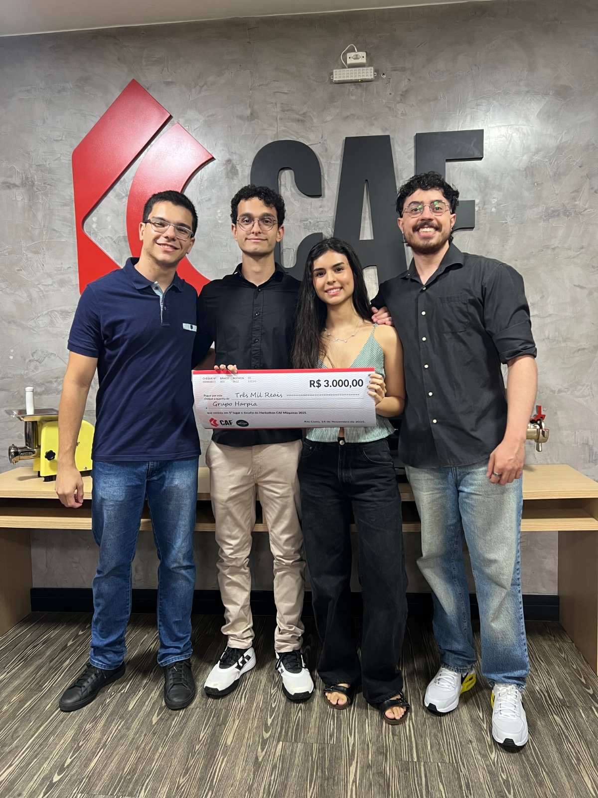

# 🦅 Grupo Harpia - Solução Hackathon CAF

> 🏆 **PROJETO VENCEDOR DO HACKATHON CAF** 🏆
>
> **Reconhecimento de Peças com IA e Automatização de Pedidos via Chatbot**

Este repositório contém a proposta de solução desenvolvida pelo **Grupo Harpia**, equipe campeã do **Hackathon CAF**. O projeto integra visão computacional e chatbots para agilizar a identificação de peças técnicas e automatizar o fluxo de vendas e assistência.

## 👥 Integrantes do Time

* **Cauan Gabriel Souza**
* **Gabriel Sanches Pinto**
* **Hannah Cavalcanti**
* **Igor Benedito**

---

## 💡 Sobre o Projeto

O objetivo principal é resolver a dificuldade de identificação de peças técnicas por parte dos clientes, otimizando o processo de compra e reposição. Nossa solução se destacou por unir simplicidade no uso (Chatbot) com alta tecnologia no backend (IA).

### Principais Funcionalidades

* **🤖 Chatbot Inteligente (ManyChat):** Gerencia o fluxo de atendimento para compras, reposições e suporte técnico.
* **📸 Identificação Visual (IA):** O cliente envia uma foto da peça e o sistema identifica o modelo automaticamente.
* **🔄 Transbordo Humano:** Caso a IA não tenha certeza, o atendimento é direcionado para um humano de forma fluida.
* **🗄️ Banco de Dados:** Armazenamento de informações utilizando SQLite.

---

## 🧠 Arquitetura da Inteligência Artificial

O núcleo da solução utiliza **Deep Learning** para classificação de imagens com alta precisão.

### Detalhes Técnicos

* **Modelo Base (Backbone):** `ResNet18` pré-treinada no dataset *ImageNet*. Escolhida por sua capacidade já estabelecida de reconhecer bordas, texturas e formas.
* **Técnica:** *Transfer Learning* (Aprendizagem por Transferência).
* **Classificador (Head):** As camadas finais da ResNet foram congeladas e substituídas por um classificador customizado (duas camadas lineares com *Dropout*) para se adaptar às peças específicas da CAF.

### Performance

O modelo atual atinge **90% de acurácia** na identificação de peças (ex: "Caracol Montado 8"), garantindo agilidade no atendimento.

---

## 🛠️ Tecnologias Utilizadas

* 
* 
* 
* 
* 

---

## 📊 Fluxo de Uso

1.  **Início:** Cliente acessa o contato (Instagram/WhatsApp).
2.  **Triagem:** O Chatbot oferece opções de serviço.
3.  **Captura:** Cliente seleciona "Reposição" e envia a foto da peça.
4.  **Inferência:**
    * O backend Python recebe a imagem.
    * O modelo PyTorch processa e classifica.
5.  **Resposta:**
    * *Sucesso:* O Chatbot confirma: "Essa peça é um [Nome da Peça]" e segue para o checkout.
    * *Falha:* O Chatbot encaminha para um atendente.

---

## 📈 Resultados de Treinamento

Os gráficos do projeto demonstram a evolução do treinamento, evidenciando a convergência da *Loss* e a estabilização da *Acurácia* tanto no treino quanto na validação.

| Métrica | Status |
| :--- | :--- |
| **Acurácia Final** | ~90% |
| **Overfitting** | Controlado via Dropout |

---
